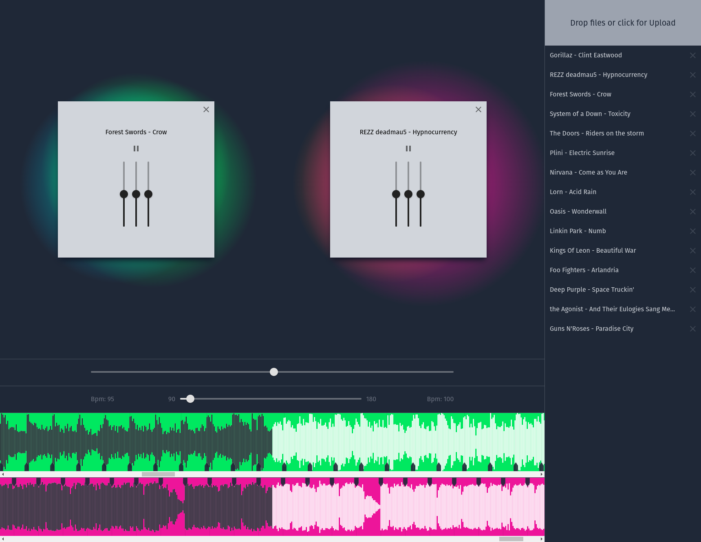
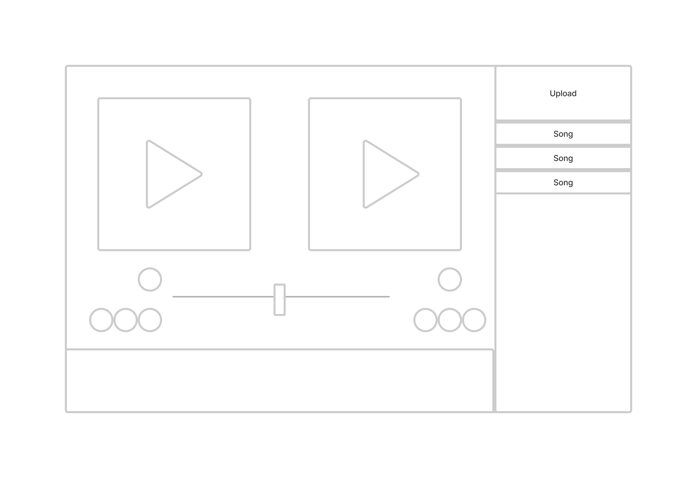

# [SimpleDJ](https://enze-l.github.io/simple-dj)
A simple DJ Application that offers an EQ, BPM-detection, Cross-Fade and automatically plays the Songs on its two decks in sync.

This Repository represents my project for the study subject "Audio- und Videotechnik" (audio- and video-technologies).



## Table of Contents
- [Usage](#Usage)
- [Installation](#Installation)
- [Technologies](#Technologies)

## Usage

1. Click in the right upper corner and select the songs you want to play. Alternatively drag and drop them in the same corner.
2. Click on one or two songs in the Song-List. They are loaded in on of the two decks.
3. Click on one or both songs to play them.
4. Play with all the faders to form the sound to your liking. The Faders on the decks are for tuning the EQ while the ones below them are for the volume and the playback speed.

## Installation 
You don't need to install this project to use it. You can just use it by clicking [here](https://enze-l.github.io/simple-dj/). If you want to install it anyway, here are the instructions:
1. clone this repository by running ```clone https://github.com/enze-l/simple-dj.git```
2. Go into the folder of you just cloned
3. run ```npm ci``` to install all necessary dependencies
4. run ```npm start``` to run the project locally

## Concept


The first Prototype was done on paper and later brought into this digital form. The core concept was to make a minimalistic music player that would enable the intuitive blending of songs for inexperienced users.

This Project started out as a group effort but was in the end only finished by one person for multiple reasons. In order to be doable for only on person, the ambitions of the initial concept had to be scaled down.

Features of the initial concepts:
- Spotify-compatibility
- Drag and drop-functionality for own songs
- Two decks for simultaneous Playback
- EQ and other effects for each deck respectively
- Cross-fading for volume
- Visualisation of the music in the background
- Visualisation of the music as an interactive timeline at the bottom
- Scrubbing functionality
- Automatic beat detection
- Automatic synchronisation of the beats of the two songs 

## Technologies
The project was realized with react while utilizing [Typescript](https://www.typescriptlang.org/). [React](https://reactjs.org/) was used because it is the most used frontend-framework. Typescript was chosen with a linter to force a certain structure for the project, enforce code-style and enabling object-oriented features for our team.

The userinterface is styled with the help of [tailwindcss](https://tailwindcss.com/) to not have to write verbose css styles. The utilized Sliders an Icons are all part of [Material-UI](https://mui.com/).

Audio is handled by the Web-Audio-API. The timeline-graph at the bottom of the screen utilizes [wavesurfer](https://wavesurfer-js.org/).
